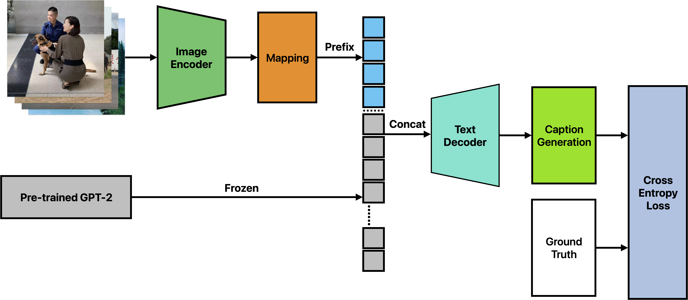
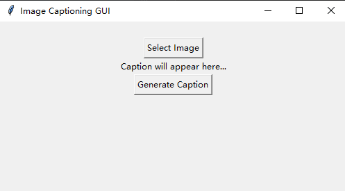
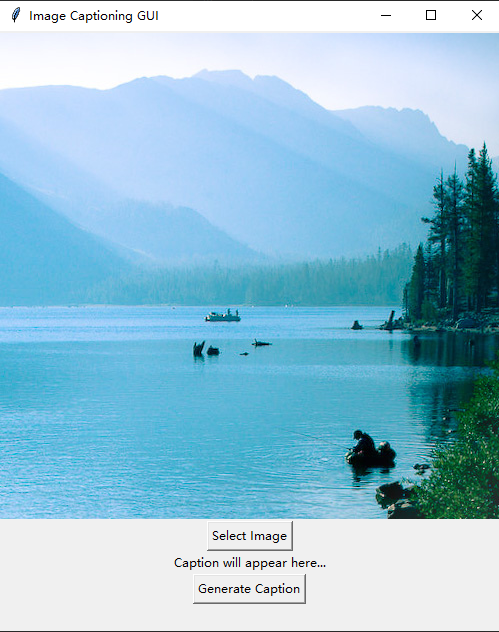
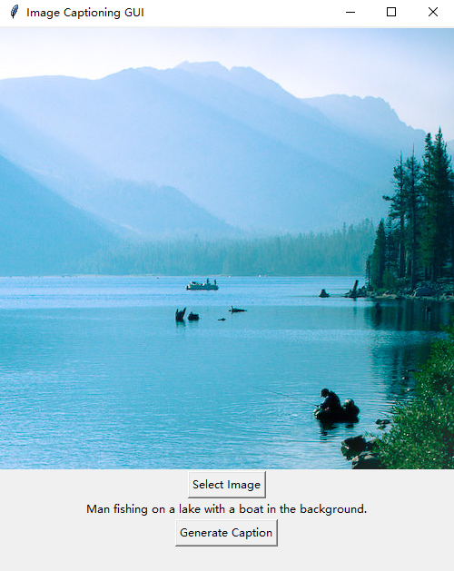

# EE5438 Project

## Image caption generation based on deep learning

This is a final project in **`EE5438(Applied Deep Learning)`**. The image caption model is based on [CLIP](https://openai.com/blog/clip/) and [GPT-2](https://openai.com/blog/better-language-models/) model. There are mainly 4 modules, First, the image encoder module is employed to extract image features and return its embedding. Then, the mapping module is used to map the image embedding to GPT-2 embedding. Next, the text decoder module is responsible for process embedding into caption. Finally, the caption generation module concatenates all pieces together and generates caption based on image. The structure of the model is shown in the picture below:



## Dataset

The flickr30k dataset is downloaded from kaggle, to get the original dataert, see:

```bash
https://www.kaggle.com/datasets/hsankesara/flickr-image-dataset
```

## Usage

Install requirements:

```bash
pip install -r requirements.txt
```

To run the main program (only predict):

```bash
python main.py
```

To train your own model:

```bash
python train.py
```

Note that the project is trained on the Flickr30k dataset, and the raw data is downloaded from [Kaggle](https://www.kaggle.com/datasets/hsankesara/flickr-image-dataset). 
To preprocess the raw data to pkl, run:

```bash
python utils.py
```

## Example results





To use our program, see [baojudezeze](https://github.com/baojudezeze/EE5438Project_Image_Caption_Generation)

### References:

- [HuggingFace](https://huggingface.co/)
- [CLIP](https://openai.com/blog/clip/)
- [GPT-2](https://openai.com/blog/better-language-Models/)
- [CLIP_prefix_caption(git)](https://github.com/rmokady/CLIP_prefix_caption)
- [clip-gpt-captioning(git)](https://github.com/jmisilo/clip-gpt-captioning)

